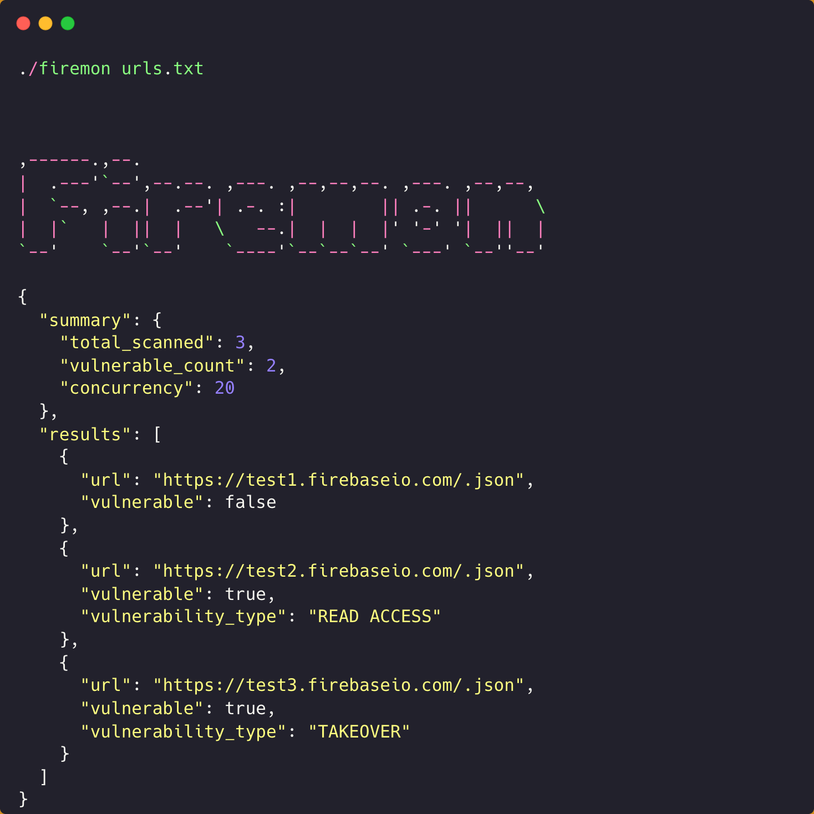

<h1 align="center">Firemon</h1>
<p align="center"><b>A Fast Concurrent CLI Tool for Firebase Vulnerability Scanning</b></p>
<p align="center">
<a href="#description">Description</a> • <a href="#features">Features</a> • <a href="#installation">Installation</a> • <a href="#usage">Usage</a> • <a href="#contactme">Contact Me</a><br><br>


  <a href="https://www.buymeacoffee.com/umair9747" target="_blank"></a>
</p>
<hr>

<hr style="width:300px; height: 1px; margin: auto; margin-top: 20px;" />
<br>
<div id="description">
<h2> Description </h2>
Firemon is a fast, concurrent CLI tool written in Golang that helps security researchers and penetration testers identify Firebase vulnerabilities. The tool processes Firebase URLs concurrently to detect read access and takeover vulnerabilities in Firebase Realtime Databases.
<br><br>
The tool is designed to efficiently scan multiple Firebase endpoints simultaneously, with configurable concurrency and detailed reporting capabilities. It automatically detects Firebase URLs and normalizes them to their root domains for comprehensive testing.
</div>
<hr style="height: 1px;">
<div id="features">
<h2> Features </h2>

<h4> Concurrent Processing </h4>
Firemon processes multiple URLs simultaneously with configurable concurrency levels (default: 20), making it extremely fast for bulk scanning operations.

<h4> Multiple Input Methods </h4>
Accept single URL, multiple URLs on command line, or read from a file containing URLs. Supports mixed input methods in a single command.

<h4> Firebase-Specific Detection </h4>
Only processes URLs containing ".firebaseio.com" as a substring, automatically filtering out non-Firebase URLs and focusing on relevant targets.

<h4> Vulnerability Detection </h4>
Detects two main types of Firebase vulnerabilities:
- **TAKEOVER**: When Firebase returns `{"error": "404 Not Found"}`
- **READ ACCESS**: When Firebase returns data without error field

<h4> Flexible Output Options </h4>
Console output with optional file saving in append mode, allowing you to build comprehensive reports across multiple scan sessions.

<h4> Verbose Mode </h4>
Detailed processing information showing URL processing, request details, and scan statistics for debugging and monitoring purposes.
</div>

<hr style="height: 1px;">

<div id="installation">
<h2> Installation </h2>
You can install Firemon by cloning the repository and building it manually.

### Clone and Build Manually

```bash
git clone https://github.com/umair9747/firemon.git
cd firemon
go mod tidy
go build .
```

### Make it Globally Available

```bash
sudo mv firemon /usr/local/bin/
```

Or add to your PATH:

```bash
export PATH=$PATH:$(pwd)
```
</div>

<hr style="height: 1px;">

<div id="usage">
<h2> Usage </h2>

### Basic Usage

```bash
# Single URL
./firemon https://test.firebaseio.com/

# Multiple URLs
./firemon https://test1.firebaseio.com/ https://test2.firebaseio.com/

# From file
./firemon urls.txt

# Mixed input
./firemon https://test.firebaseio.com/ urls.txt https://another.firebaseio.com/
```

### Flags

- `-c, --concurrency`: Set concurrency level (default: 20)
- `-o, --outputFile`: Save vulnerable URLs to file (append mode for text, overwrite for JSON)
- `-v, --verbose`: Enable verbose output
- `-j, --json`: Output results in JSON format

### Examples

```bash
# Scan with custom concurrency
./firemon -c 50 https://test.firebaseio.com/

# Scan with output file
./firemon -o results.txt https://test.firebaseio.com/

# Verbose scanning from file
./firemon -v -c 30 -o results.txt urls.txt

# High concurrency batch scan
./firemon -v -c 100 -o firebase_vulns.txt firebase_targets.txt

# JSON output to console
./firemon -j https://test.firebaseio.com/

# JSON output to file
./firemon -j -o results.json urls.txt
```

### Input File Format

Create a text file with one URL per line:

```
https://test1.firebaseio.com/
https://test2.firebaseio.com/users/
https://test3.firebaseio.com/data/test.json
# Comments are ignored
https://test4.firebaseio.com/
```

### Output Format

#### Text Output
```
https://test.firebaseio.com/.json [VULNERABLE : TAKEOVER]
https://example.firebaseio.com/.json [VULNERABLE : READ ACCESS]
```

#### JSON Output
```json
{
  "summary": {
    "total_scanned": 3,
    "vulnerable_count": 2,
    "concurrency": 20
  },
  "results": [
    {
      "url": "https://test.firebaseio.com/.json",
      "vulnerable": true,
      "vulnerability_type": "TAKEOVER"
    },
    {
      "url": "https://example.firebaseio.com/.json",
      "vulnerable": true,
      "vulnerability_type": "READ ACCESS"
    },
    {
      "url": "https://secure.firebaseio.com/.json",
      "vulnerable": false
    }
  ]
}
```

### Verbose Output

```
Processing 3 URLs with concurrency 20
Processing Firebase URL: https://test.firebaseio.com/users -> https://test.firebaseio.com/
Checking: https://test.firebaseio.com/.json
https://test.firebaseio.com/.json [VULNERABLE : TAKEOVER]

Scan completed. Found 1 vulnerable endpoints out of 3 total.
Results saved to results.txt
```
</div>

<hr style="height: 1px;">

<div id="contactme">
<h2> Contact Me </h2>
Have any suggestions, queries, feedback or just want to connect with me? Feel free to reach out using the below handles:
<ul type="disc">
<li><a href="https://www.linkedin.com/in/umair-nehri-49699317a">LinkedIn</a></li>
<li><a href="https://twitter.com/0x9747/">Twitter / X</a></li>
</ul>

Also, if you'd like to support me for my future research works, please consider using <a href="https://www.buymeacoffee.com/umair9747">this link</a> for your donations!
</div>